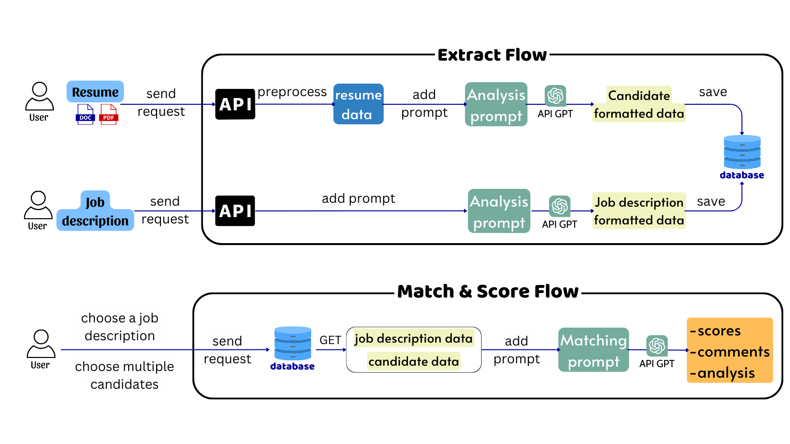

# Resume Ranking System

## Overview

The Resume Ranking System is a powerful tool designed to streamline the recruitment process by automatically evaluating and ranking resumes based on relevant criteria.

## Architecture

<p align="center">
  
  <br>
  <em>System Architecture</em>
</p>

## Features

- **Job Analysis**:

  - Manage JDs
  - Analyze JDs to standard forma
  - Multilingual Support.
  - Average runtime: 30 seconds

- **Candidate Analysis**:

  - Upload and manage CVs (PDF/ Word)
  - Extract Personal information.
  - Analyze CVs to standard format.
  - Multilingual Support.
  - Average runtime: 60 seconds

- **Matching Analysis**:

  - Manage candidates & jobs with a
    many-to-many relationship
  - Analyze and score candidate based
    on each key field.
  - Average runtime: 30 seconds

- **Score, Rank & Comment**:
  - Provides a summary analysis of the
    matching between candidates and
    jobs
  - Score and rank candidate.


1. **Clone the Repository**:

   ```bash
   git clone https:/
   ```

2. **Update environment**:

   - Update **OPENAI_API_KEY** in `analysis_service/.env`

     ```bash
     OPENAI_API_KEY="your-key"
     ```

   - Update **IP Address** in `frontend/.env.production`
     ```bash
     NEXT_PUBLIC_API_URL=http://<your-ip-address>/backend
     ```

3. **Install Dependencies**:

   ```bash
   cd resume-ranking
   docker compose build
   ```

4. **Run the System**:

   ```bash
   docker compose up
   ```